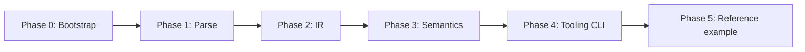

# Implementation Plan

Phased plan to build the Zemi POC compiler and CLI, from repository bootstrap through success criteria in [POC Specification](./09-poc-spec.md).

**Status:** Ready to execute once [POC Design Decisions](./10-poc-design-decisions.md) is accepted  
**Prerequisite design docs:** 01–08 (vision), 09–10 (POC scope and decisions)

---

## Overview



Each phase ends with a **demo command** that works on real input. Phases are sequential; do not start codegen.

---

## Phase 0: Bootstrap

**Goal:** Runnable repo skeleton with CI and reference file stubs.

### Tasks

- [ ] Initialize Rust workspace at repo root
- [ ] Crate layout (see [Repository layout](#repository-layout))
- [ ] `zemi` CLI stub: prints version, exits 0
- [ ] Add `example/` directory with reference program from [09-poc-spec.md](./09-poc-spec.md) (syntax placeholders OK)
- [ ] GitHub Actions: `cargo fmt --check`, `cargo clippy`, `cargo test`

### Demo

```bash
cargo run -p zemi-cli -- --version
# zemi 0.1.0-poc
```

### Exit criteria

- Workspace builds on stable Rust
- CI green on empty tests

---

## Phase 1: Parse

**Goal:** Lex and parse the POC surface syntax into an AST.

### Tasks

- [ ] Lexer: keywords (`component`, `library`, `port`, `ingress`, `egress`, `source`, `sink`, `wiring`, `export`, `fn`, `type`, `struct`), operators (`|>`, `->`), literals, identifiers
- [ ] AST nodes: `ComponentDecl`, `LibraryDecl`, `PortDecl`, `PipelineExpr`, `WiringDecl`, `FnDecl`, `TypeDecl`
- [ ] Parser: recursive descent or chumsky parser for reference grammar
- [ ] Parser tests: one test per major construct from reference program
- [ ] `zemi parse <file>` — pretty-print AST (debug)

### Demo

```bash
zemi parse example/app.zemi
# Component(App) { ports: [Port(HttpIngress)...], ... }
```

### Exit criteria

- Reference program files parse without error
- Malformed syntax produces source-span error

---

## Phase 2: IR

**Goal:** Lower AST to architecture-aware IR; serialize to JSON.

### Tasks

- [ ] Define IR types in `zemi-ir` crate (see [09-poc-spec.md § IR requirements](./09-poc-spec.md#ir-requirements))
- [ ] AST → IR lowering: components, libraries, ports, pipelines, wiring
- [ ] Preserve source spans on IR nodes for diagnostics
- [ ] `zemi ir <file>` — emit JSON to stdout or `--output`

### Demo

```bash
zemi ir example/ --output /tmp/app.ir.json
# valid JSON with ComponentNode, PortNode, WiringNode
```

### Exit criteria

- IR JSON schema documented in `docs/design/ir-schema.md` (created during this phase)
- Round-trip: parse → IR → graph queries without re-parsing source

---

## Phase 3: Semantics

**Goal:** Architecture-aware checks and diagnostics.

### Tasks

- [ ] Name resolution: components, ports, libraries within a compilation unit
- [ ] Type classification: Raw vs. Interpreted (builtin table + user struct registry)
- [ ] **Z001** — cross-component interior import
- [ ] **Z002** — port on library
- [ ] **Z003** — ingress output is Raw
- [ ] **Z004** — Raw leak in component interior
- [ ] **Z005** — unwired external source port
- [ ] **Z006** — dead component in wiring graph
- [ ] Wiring resolution: load wiring file, match `--wiring` flag
- [ ] `zemi check <path>` — run all checks, exit non-zero on errors

### Demo

```bash
zemi check example/
# ok

# Introduce intentional Raw leak in example — expect Z004
zemi check example/broken/raw_leak.zemi
# error[Z004]: Raw type `Bytes` used outside port pipeline
```

### Exit criteria

- All six diagnostic codes implemented with tests
- Reference program passes `zemi check` with zero errors

---

## Phase 4: Tooling CLI

**Goal:** Architecture queries from IR — the POC payoff.

### Tasks

- [ ] `zemi components list` — flat or tree listing
- [ ] `zemi components graph` — DOT + indented text
- [ ] `zemi ports list` — table: component, port, direction, stages
- [ ] `zemi wiring show` — resolved edges for current wiring profile
- [ ] Snapshot tests for CLI output against reference program

### Demo

```bash
zemi components graph example/ | dot -Tpng -o /tmp/arch.png
zemi ports list example/
# App.HttpIngress  ingress  tcp  [decode_utf8, Http.parse_request, ...]
# App.UserService.GetUser  ingress  sibling  [extract_user_id, load_user, to_response]
```

### Exit criteria

- Graph shows external edge, inter-component edge, and hides libraries
- Output stable enough for snapshot tests

---

## Phase 5: Reference example

**Goal:** Complete, documented end-to-end example; POC success criteria met.

### Tasks

- [ ] Finalize `example/` program matching [09-poc-spec.md](./09-poc-spec.md)
- [ ] Add `example/broken/` with one file per diagnostic (negative tests)
- [ ] README section: "Running the POC"
- [ ] Walkthrough doc: `docs/poc/walkthrough.md` (how to read graph output)
- [ ] Review POC decisions for graduation to main decision log

### Demo

```bash
zemi check example/
zemi components graph example/
zemi ports list example/
zemi wiring show example/ --wiring example/wiring/test.zemi
# all succeed; documentation matches behavior
```

### Exit criteria

- All eight success criteria from [09-poc-spec.md](./09-poc-spec.md) verified
- Team can clone repo and reproduce demo in under five minutes

---

## Repository layout

```
zemi/
├── Cargo.toml                 # workspace
├── crates/
│   ├── zemi-cli/              # clap CLI binary
│   ├── zemi-parser/             # lexer + AST
│   ├── zemi-ir/               # IR types + lowering
│   ├── zemi-check/            # semantic analysis + diagnostics
│   └── zemi-graph/            # component graph + DOT emission
├── example/
│   ├── app.zemi
│   ├── lib/
│   │   ├── json.zemi
│   │   └── http.zemi
│   ├── wiring/
│   │   ├── prod.zemi
│   │   └── test.zemi
│   └── broken/                # negative test fixtures (Phase 5)
├── docs/
│   ├── design/                # 01–11 design documents
│   └── poc/
│       └── walkthrough.md     # created in Phase 5
└── .github/workflows/ci.yml
```

---

## Testing strategy

| Layer | Approach |
|-------|----------|
| Parser | Unit tests: snippet → AST golden snapshots |
| IR | Lowering tests: AST → IR JSON snapshots |
| Semantics | One test file per diagnostic code (`Z001`–`Z006`) |
| CLI | Integration tests: invoke commands, compare stdout snapshots |
| Reference | `example/` must pass `zemi check` in CI |

Avoid testing Rust stdlib behavior. Focus on architecture-specific behavior.

---

## Risks and mitigations

| Risk | Mitigation |
|------|------------|
| Syntax churn invalidates parser | Lock syntax to reference program in 09; change via explicit doc update |
| Raw/interpreted rules too coarse | Sufficient for POC; refine after leak lint proves useful |
| Wiring model too simple for real apps | POC proves structural wiring; runtime config deferred |
| Scope creep into codegen | Explicit non-goal; IR JSON is the output |
| chumsky learning curve | Fall back to hand-written parser in Phase 1 if blocked > 2 days |

---

## After the POC

If success criteria pass:

1. **Graduate decisions** — move validated POC choices to [08-open-questions.md](./08-open-questions.md) decision log
2. **Second scenario on paper** — hex editor or CLI processor per [09-poc-spec.md § Design exercises](./09-poc-spec.md#design-exercises-post-poc)
3. **Egress ports** — design enforcement mirroring ingress
4. **Effect metadata** — attach to port IR, lint reachability
5. **Codegen spike** — transpile to Rust as first target (separate track)

If success criteria fail:

- Document which thesis claim failed (parse? graph? lint?)
- Revise [10-poc-design-decisions.md](./10-poc-design-decisions.md) before more implementation

---

## Quick start (after Phase 0)

```bash
git clone <repo>
cd zemi
cargo build
cargo run -p zemi-cli -- check example/
```

---

## Checklist: design complete → implementation start

Before Phase 0 begins, confirm:

- [x] [09-poc-spec.md](./09-poc-spec.md) accepted as POC scope
- [x] [10-poc-design-decisions.md](./10-poc-design-decisions.md) accepted as provisional spec
- [ ] Reference program syntax reviewed (no ambiguous constructs)
- [ ] Team agrees ingress-only is sufficient for v0
- [ ] IR JSON is acceptable POC output (no codegen)

Once the last three items are checked, start Phase 0.
